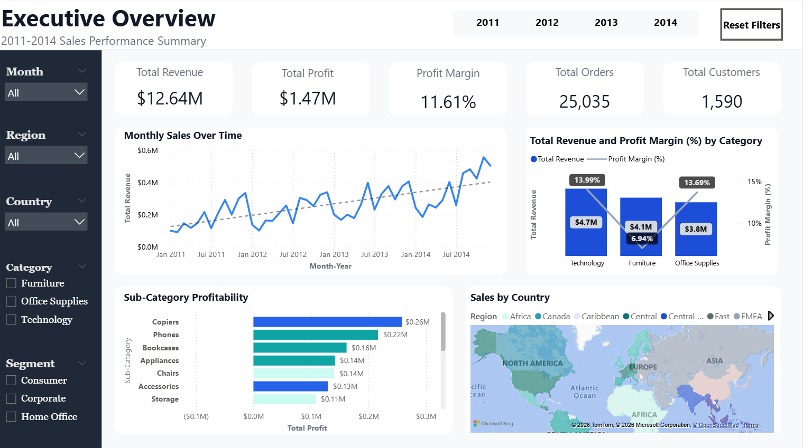
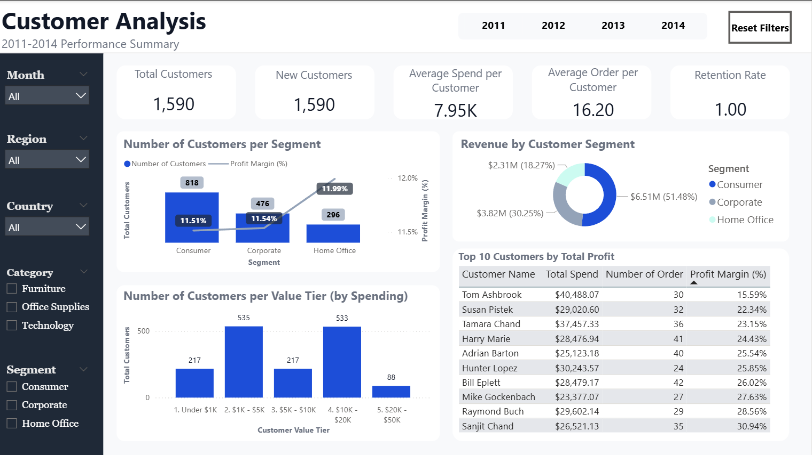
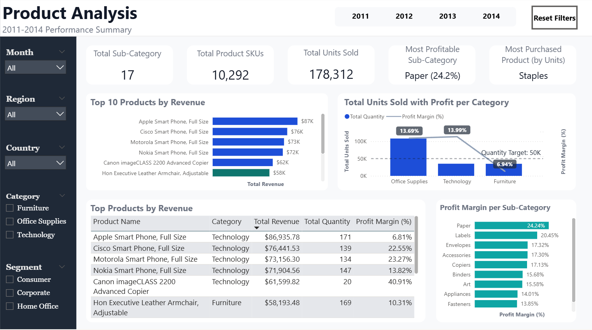
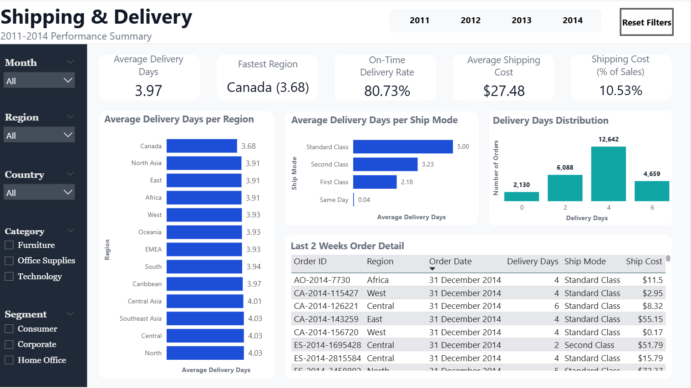

# 📊 Retail Sales Performance Dashboard (Power BI)
 
An interactive Power BI dashboard built on the **Global Superstore dataset (Kaggle)**, analyzing sales, profitability, customer behavior, product performance, and shipping efficiency for a retail business.

---

## 🔍 Overview
 
This dashboard turns raw retail order data into an interactive, multi-page report designed to help stakeholders quickly answer questions like:
 
- How are sales and profit trending over time, and by region?
- Which customer segments and value tiers drive the most revenue?
- Which products and sub-categories are most (and least) profitable?
- How efficient is order fulfillment and delivery?

It's built as a portfolio project to demonstrate data modeling, DAX measure design, and dashboard building skills in Power BI.

---
 
## 🖥️ Pages
 
### 1. Executive Overview
High-level KPIs and trends for leadership at a glance.
- **KPI cards:** Total Revenue, Total Profit, Profit Margin, Total Orders, Total Customers
- **Monthly Sales Over Time** (line chart)
- **Sales by Country** (map)
- **Sub-Category Profitability** (bar chart)
- Combo chart of sales/profit trend
- Filters: Segment, Category, Country, Region, Month, Year

### 2. Customer Analysis
Understanding who the customers are and how they behave.
- **KPI cards:** Total Customers, New Customers, Average Spend per Customer, Average Order per Customer, Retention Rate
- **Top 10 Customers by Total Profit** (table)
- **Revenue by Customer Segment** (donut chart)
- **Number of Customers per Segment / Value Tier** (bar/column charts)

### 3. Product Analysis
Performance across categories, sub-categories, and individual products.
- **KPI cards:** Total Sub-Categories, Total Product SKUs, Most Purchased Product, Total Units Sold, Most Profitable Sub-Category
- **Top 10 Products by Revenue** (bar chart)
- **Profit Margin per Sub-Category** (bar chart)
- **Total Units Sold with Profit per Category** (combo chart)
- Top Products by Revenue (table)

### 4. Shipping & Delivery
Fulfillment and logistics performance.
- **KPI cards:** Average Delivery Days, On-Time Delivery Rate, Shipping Cost (% of Sales), Average Shipping Cost, Fastest Region
- **Average Delivery Days per Region / Ship Mode** (bar charts)
- **Delivery Days Distribution** (column chart)
- Last 2 Weeks Order Detail (table)

All four pages share a common filter panel (Segment, Category, Country, Region, Month, Year) for consistent cross-page slicing.
 
---

## 🗂️ Data Model
 
The report is built on the **Superstore dataset**, structured as a star schema:
 
| Table | Description |
|---|---|
| `Order` | Fact table — order-level transactions (Sales, Profit, Quantity, Discount, Ship Mode, Segment, Category, Sub-Category, Region, Country, Product Name, Customer ID, etc.) |
| `Date_Table` | Date dimension with a Year → Month hierarchy, used for time intelligence |
| `_Measures` | A dedicated (disconnected) table holding all DAX measures for organization |

---

## 📸 Screenshots
 
| Executive Overview | Customer Analysis |
|---|---|
|  |  |
 
| Product Analysis | Shipping & Delivery |
|---|---|
|  |  |
 
---

## 📌 Data Source
 
[Superstore Sales Dataset — Kaggle](https://www.kaggle.com/datasets/apoorvaappz/global-super-store-dataset)
 
